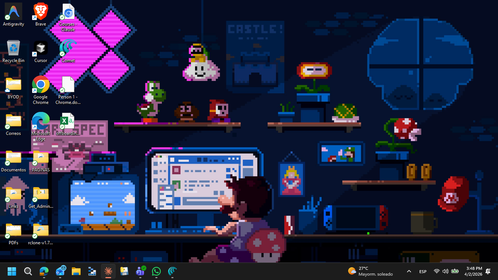

# 🔒 JBKnowledge IT Offboarding Portal

A single-page web application for IT admins to securely offboard Microsoft 365 users: back up OneDrive & emails to Azure Blob Storage, remove licenses and group memberships, and block sign-in — all in one auditable workflow.

**Live app:** https://black-cliff-00e487410.6.azurestaticapps.net

---

## Screenshots

### Login


### Search & Checklist


### Backup Panel


### Offboarding Actions


### Full Run


### History & Audit Trail


### Dark Mode


---

## Features

| Feature | Description |
|---------|-------------|
| 🔍 User search | Search M365 users by name or email via Graph API |
| ✅ Pre-offboarding checklist | Auto-runs: OneDrive size, mailbox, groups, licenses |
| 📁 OneDrive backup | Recursively backs up all files to Azure Blob Storage |
| 📧 Email backup | Backs up all mail folders and messages as .eml files |
| ⚙️ Offboarding actions | Remove licenses, remove groups, block sign-in |
| 📋 History | Full log with filters, stats dashboard, CSV export |
| 🔐 Audit trail | Per-action audit log stored in blob storage |
| 👥 Batch offboarding | Queue multiple users and process sequentially |
| 📅 Scheduled tasks | Schedule backup, offboarding, or Full Run for later |
| 🚀 Full Run | One-click: backup → offboarding → combined email summary |
| ✏️ Email template | Customizable notification email (subject + HTML body) |
| 📋 Custom checklist | Add persistent custom checklist items (localStorage) |
| 🌙 Dark mode | Toggle dark/light theme, persisted in localStorage |
| 🌎 EN / ES | Full English and Spanish UI |

---

## Architecture

```
index.html               ← Single-page app (all logic inline)
_deploy/index.html       ← Copy deployed to Azure Static Web Apps
api/                     ← Azure Functions (Node.js) — Graph token proxy
  token/index.js         ← Returns app-level Graph token (client credentials)
staticwebapp.config.json ← SWA routing config
setup.sh / setup.bat     ← Interactive setup scripts to inject your credentials
```

**Stack:** Vanilla JS + HTML/CSS · MSAL.js · Microsoft Graph API · Azure Blob Storage · Azure Static Web Apps · Azure Functions

---

## Prerequisites

- Azure Subscription with permissions to create resources
- Microsoft 365 tenant with Global Admin (or equivalent)
- Node.js v16+ and npm
- SWA CLI: `npm install -g @azure/static-web-apps-cli`

---

## Setup

### 1 — Azure AD App Registration

1. [portal.azure.com](https://portal.azure.com) → Azure Active Directory → App registrations → **New registration**
2. Name: `Offboarding App` · Single tenant · Redirect URI: your SWA URL
3. Note **Application (client) ID** → `CLIENT_ID` and **Directory (tenant) ID** → `TENANT_ID`
4. Add **Microsoft Graph** API permissions:

| Permission | Type |
|------------|------|
| `User.Read` | Delegated |
| `User.Read.All` | Application |
| `User.ReadWrite.All` | Application |
| `Directory.Read.All` | Application |
| `Directory.ReadWrite.All` | Application |
| `Mail.ReadWrite` | Application |
| `Files.ReadWrite.All` | Application |
| `LicenseAssignment.ReadWrite.All` | Application |
| `Mail.Send` | Delegated |

5. **Grant admin consent** for all permissions
6. Certificates & secrets → New client secret → copy value (for Azure Functions)

### 2 — Azure Functions (Token Proxy)

1. Create Azure Function App (Node.js 18, Consumption)
2. Add Application Settings:
   - `CLIENT_ID` = your App Registration Client ID
   - `CLIENT_SECRET` = your client secret
   - `TENANT_ID` = your Azure AD Tenant ID
3. Deploy the `api/` folder
4. Note the Function App URL → `API_URL`

### 3 — Azure Blob Storage

1. Create Storage Account → create container (e.g. `offboarding-backups`) — **Private** access
2. Shared Access Signature → configure:
   - Services: **Blob** · Resource types: **Container + Object**
   - Permissions: Read, Write, Delete, List, Add, Create, Update, Process
   - Protocol: **HTTPS only** · Set expiry date
3. Generate SAS → copy the **SAS token** (starts with `sv=...`)

### 4 — Configure index.html

Run the interactive setup script:

```bash
# macOS / Linux
bash setup.sh

# Windows
setup.bat
```

You will be prompted for:
- Azure AD Client ID
- Azure AD Tenant ID
- Storage Account name
- SAS Token
- Container name
- Azure Functions API URL

### 5 — Deploy to Azure Static Web Apps

```bash
mkdir -p _deploy
cp index.html _deploy/index.html
npx @azure/static-web-apps-cli deploy \
  --app-location ./_deploy \
  --env production \
  --deployment-token YOUR_SWA_DEPLOYMENT_TOKEN
```

Get your deployment token from: Static Web App → **Manage deployment token**

---

## Local Development

```bash
npx @azure/static-web-apps-cli start . --port 4280
```

Add `http://localhost:4280` to your App Registration redirect URIs.

---

## Security Notes

- **Never commit real credentials** — use `setup.sh` / `setup.bat` to inject them locally
- Rotate the SAS token periodically and set a reasonable expiry
- Store the Azure Function client secret in **Azure Key Vault** for production
- All actions are logged to `_audit/trail.json` in blob storage

---

## License

MIT — Internal tool, JBKnowledge IT Department.
